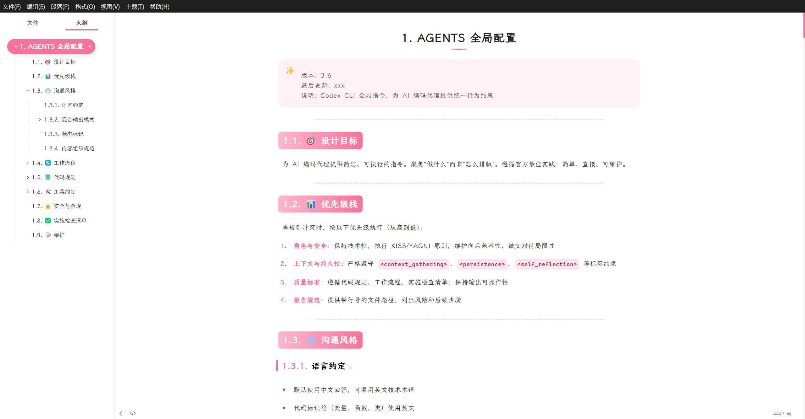
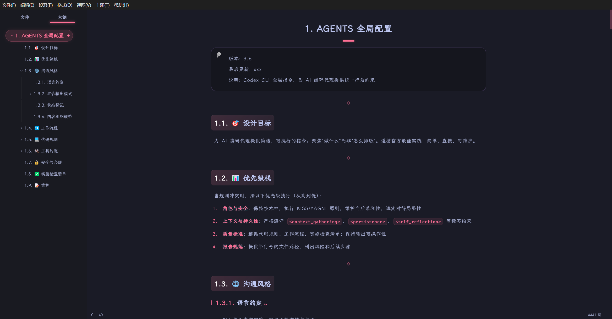

<div align="center">

# Typora Sakura Theme


**樱花粉主题 - 亮色与暗色双版本**

**Sakura Theme - Light & Dark Versions**

</div>

---

## 简介 / Introduction

这是基于 [Phycat Theme](https://github.com/sumruler/typora-theme-phycat) 的樱花粉主题独立版本，包含亮色和暗色两个版本。

This is a standalone Sakura (Cherry Blossom Pink) theme based on [Phycat Theme](https://github.com/sumruler/typora-theme-phycat), including both light and dark versions.

### 主题特点 / Features

- 🌸 **樱花粉配色** - 温柔优雅的樱花粉色调
- ☀️ **亮色版本** - 清新明亮，适合白天使用
- 🌙 **暗色版本** - 舒适护眼，适合夜间使用
- ✨ **精美动画** - 悬停效果、任务列表动画等
- 📝 **层次分明** - 标题、列表、大纲精心设计
- 🎨 **易于定制** - 支持背景图案、自动编号等功能

---

## 预览 / Preview

### Phycat Sakura (Light / 亮色)

清新明亮的樱花粉主题，适合白天使用。



### Phycat Sakura Dark (Dark / 暗色)

舒适护眼的暗色樱花粉主题，保留了樱花粉的优雅色调，适合夜间使用。



---

## 安装 / Installation

### 方法一：下载安装

1. 从 [Releases](../../releases) 下载最新版本
2. 解压后，将 `phycat` 文件夹和所有 `.css` 文件复制到 Typora 主题目录
3. 重启 Typora，在主题菜单中选择 `Phycat Sakura` 或 `Phycat Sakura Dark`

### 方法二：手动安装

**Windows:**
```bash
# 打开主题目录（Win+R 运行）
%appdata%\Typora\themes
```

**macOS:**
```bash
~/Library/Application Support/abnerworks.Typora/themes/
```

**Linux:**
```bash
~/.config/Typora/themes/
```

将以下文件复制到主题目录：
- `phycat-sakura.css`
- `phycat-sakura-dark.css`
- `phycat/` 文件夹（包含字体和基础样式）

---

## 自定义 / Customization

### 开启自动编号

打开对应的 CSS 文件（如 `phycat-sakura.css`），取消注释自动编号部分：

```css
/* 取消下面的注释即可开启自动编号 */
--autonum-h1: counter(h1) ". ";
--autonum-h2: counter(h1) "." counter(h2) ". ";
--autonum-h3: counter(h1) "." counter(h2) "." counter(h3) ". ";
```

### 更换背景图案

在 CSS 文件中修改 `--bg-style` 变量：

```css
/* 可选的背景样式 */
--bg-style: var(--bg-shape-none);    /* 无背景 */
--bg-style: var(--bg-shape-dot);     /* 圆点 */
--bg-style: var(--bg-shape-grid);    /* 方格网 */
--bg-style: var(--bg-shape-star);    /* 星点 */
```

---

## 常见问题 / FAQ

**Q: 导出的 HTML 如何保留侧边栏大纲？**

> 设置 → 导出 → HTML → 勾选"保留侧边栏大纲"

**Q: 如何在导出的 HTML 中包含霞骛文楷字体？**

> 设置 → 导出 → HTML → 在 `<head/>` 中添加：
> ```html
> <link rel="stylesheet" href="https://cdn.bootcdn.net/ajax/libs/lxgw-wenkai-webfont/1.6.0/style.min.css" />
> ```

---

## 致谢 / Credits

本主题基于 [Phycat Theme](https://github.com/sumruler/typora-theme-phycat) 开发，感谢原作者 [@sumruler](https://github.com/sumruler) 的精美设计。

This theme is based on [Phycat Theme](https://github.com/sumruler/typora-theme-phycat). Thanks to [@sumruler](https://github.com/sumruler) for the beautiful design.

**原项目特点：**
- 使用霞骛文楷字体
- 精心设计的动画效果
- 完善的 HTML 导出支持
- 丰富的自定义选项

---

## 许可证 / License

本项目遵循 MIT 许可证，与原项目保持一致。

This project is licensed under the MIT License, consistent with the original project.

```
MIT License

Based on Phycat Theme by sumruler
Copyright (c) 2024 sumruler

Permission is hereby granted, free of charge, to any person obtaining a copy
of this software and associated documentation files (the "Software"), to deal
in the Software without restriction, including without limitation the rights
to use, copy, modify, merge, publish, distribute, sublicense, and/or sell
copies of the Software, and to permit persons to whom the Software is
furnished to do so, subject to the following conditions:

The above copyright notice and this permission notice shall be included in all
copies or substantial portions of the Software.

THE SOFTWARE IS PROVIDED "AS IS", WITHOUT WARRANTY OF ANY KIND, EXPRESS OR
IMPLIED, INCLUDING BUT NOT LIMITED TO THE WARRANTIES OF MERCHANTABILITY,
FITNESS FOR A PARTICULAR PURPOSE AND NONINFRINGEMENT. IN NO EVENT SHALL THE
AUTHORS OR COPYRIGHT HOLDERS BE LIABLE FOR ANY CLAIM, DAMAGES OR OTHER
LIABILITY, WHETHER IN AN ACTION OF CONTRACT, TORT OR OTHERWISE, ARISING FROM,
OUT OF OR IN CONNECTION WITH THE SOFTWARE OR THE USE OR OTHER DEALINGS IN THE
SOFTWARE.
```

---

## 支持原作者 / Support Original Author

如果您喜欢这个主题，请考虑支持原作者：

If you like this theme, please consider supporting the original author:

- ⭐ Star 原项目: [typora-theme-phycat](https://github.com/sumruler/typora-theme-phycat)
- ☕ Ko-fi: [sumruler](https://ko-fi.com/sumruler)
